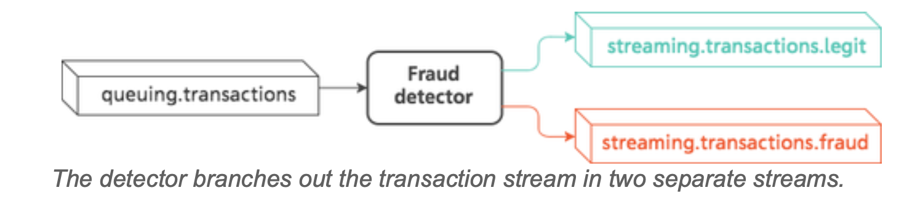

## Kafka Mini Project - Building A Streaming Fraud Detection App With Kafka
Building A Streaming Fraud Detection System With Kafka + Python + Docker Compose





### Project Structure

```
├── detector
│   ├── app.py
│   ├── Dockerfile
│   ├── __init__.py
│   └── requirements.txt
├── docker-compose.kafka.yml
├── docker-compose.yml
├── generator
│   ├── app.py
│   ├── Dockerfile
│   ├── __init__.py
│   ├── requirements.txt
│   └── transactions.py

```
### Kafka Zookeeper and broker container
In this container group, we use zookeeper and kafka images (broker) from Confluentinc. The broker listens on port 9092 (`KAFKA_ADVERTISED_LISTENERS=PLAINTEXT://broker:9092`) and connect to the zookeeper through port 32181 (`KAFKA_ZOOKEEPER_CONNECT=zookeeper:32181`).

docker-compose.kafka.yml
```
 version: "3" 
 
 services:
     zookeeper:
         image: confluentinc/cp-zookeeper:latest
         hostname: zookeeper
         ports:
             - '32181:32181'                                                                                                                                                                                      
         environment:
             ZOOKEEPER_CLIENT_PORT: 32181
             ZOOKEEPER_TICK_TIME: 2000
     broker:
         image: confluentinc/cp-kafka:latest
         depends_on:
             - zookeeper
         environment:
             - KAFKA_BROKER_ID=1
             - KAFKA_ZOOKEEPER_CONNECT=zookeeper:32181
             - KAFKA_ADVERTISED_LISTENERS=PLAINTEXT://broker:9092
             - KAFKA_OFFSETS_TOPIC_REPLICATION_FACTOR=1
 networks:
     default:
         external:
             name: kafka-network

```
### Application container
We implement our application followed the single-event processing design pattern such that the pruducer writes transaction events into one topic and the consumer reads events in that topic and uses a helper function to classify the event type (legit/fraud). 

`docker-compose.yml`:
```
 version: "3" 
 
 services:                                                                                                                                                                                                        
     generator:
         build: ./generator
         environment:
             KAFKA_BROKER_URL: broker:9092
             TRANSACTIONS_TOPIC: queueing.transactions
             TRANSACTIONS_PER_SECOND: 1000
     detector:
         build: ./detector
         environment:
             KAFKA_BROKER_URL: broker:9092
             TRANSACTIONS_TOPIC: queueing.transactions
             LEGIT_TOPIC: streaming.transactions.legit
             FRAUD_TOPIC: streaming.transactions.fraud
      
 networks:
     default:
         external:
             name: kafka-network
```

* ***How to classify events?***: We assume that a transaction event is fraud if its amount exceed $900.


## How to run
* Step 1: Create docker network and build and start the kafka container
To connect our app container group with Kafka container group, we use the same network configuration in docker-compose file and connect our app to kafka borker through enrionment variable `KAFKA_BROKER_URL: broker:9092`

```
docker-compose -f docker-compose.kafka.yml build && docker-compose -f docker-compose.kafka.yml up
```


* Step 2: Build and start our application container (generator and detector)
```
docker-compose build && docker-compose up
```

* Test the consumer using built-in `kafka-console-consumer`
```
docker-compose -f docker-compose.kafka.yml exec broker kafka-console-consumer --bootstrap-server localhost:9092 --topic streaming.transactions.fraud
docker-compose -f docker-compose.kafka.yml exec broker kafka-console-consumer --bootstrap-server localhost:9092 --topic streaming.transactions.legit
```

## Teardown 

*stop all running containers

```
docker stop $(docker ps -aq)
```
* Remove all containers
```
docker rm $(docker ps -aq)
```
Remove all images
```
docker rmi $(docker images -q)

```
